### NLP Research Highlights

#### [A Review of the Neural History of Natural Language Processing](https://ruder.io/a-review-of-the-recent-history-of-nlp/) (Recommend)
|  Year | Milestone | Remark | Other Milestones
| ---------------- | ---- | --- | ----
|2001 | **Neural language models** | 

Click to expand
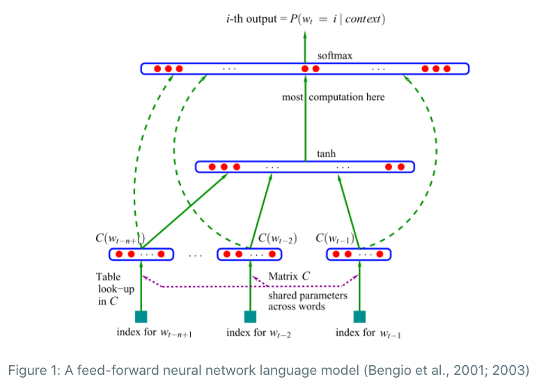 | Conditional random fields (CRF)
|2003 | | | Latent dirichlet allocation (LDA)
|2008 | **Multi-task learning** | 

Click to expand
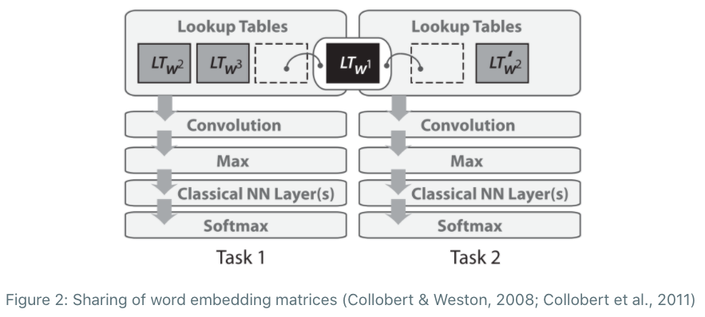 | Wikipedia Dataset
|2013 | **Word embedding** | 

Click to expand
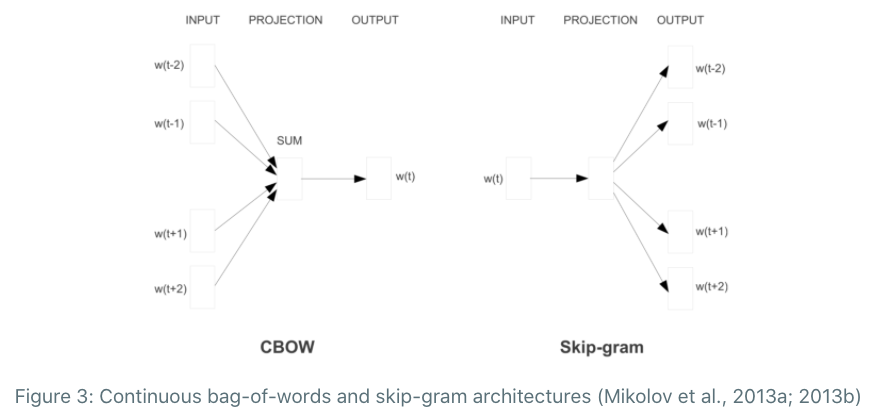   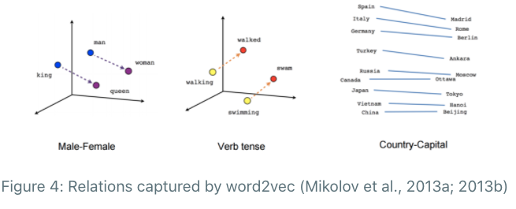
| | **Neural networks for NLP** | 

Click to expand
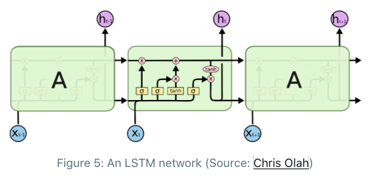   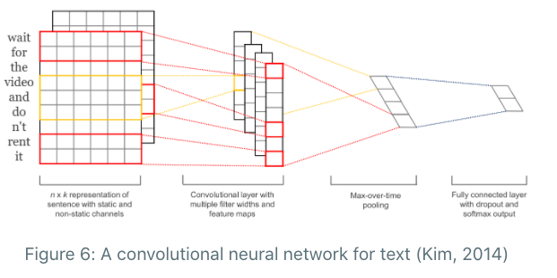
|2014 | **Sequence-to-sequence models** | 

Click to expand
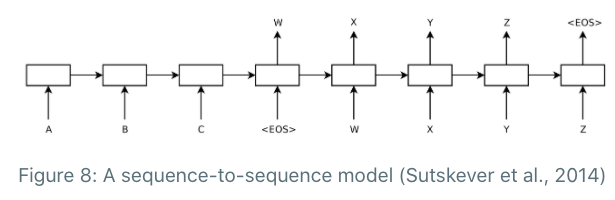  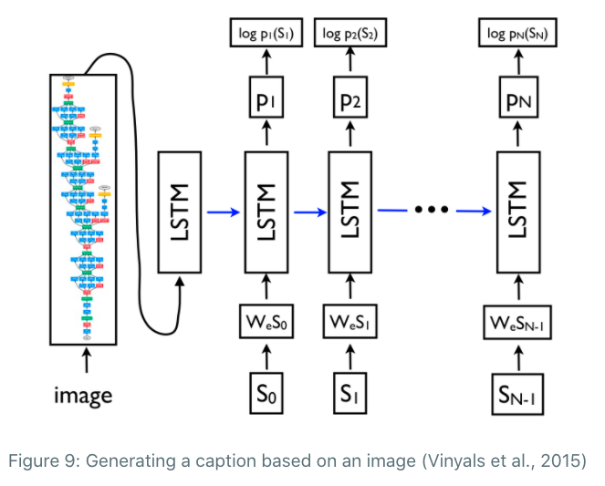
|2015 | **Attention** | 

Click to expand
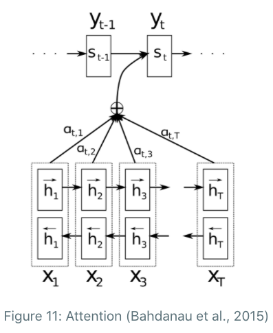   need to calculate an attention value for each combination of input and output word (i.e. looking at everything in detail before deciding what to focus on) and char-level computation can be enormous. Proposition: RL agent predict attention region.| Character-based representations
| | **Memory-based networks**
|2018 | **Pretrained language models**

#### [4 Major Open Problems](https://ruder.io/4-biggest-open-problems-in-nlp/index.html) (Recommend)

| Natural language understanding| NLP for low-resource scenarios | Reasoning about large or multiple documents | Datasets, problems, and evaluation
| -----| ---- | -- | -- |
| The consensus was that none of our current models exhibit 'real' understanding of natural language.   1. Innate biases vs. learning from scratch   2. Program synthesis   3. Embodied learning   4. Emotion   5. Cognitive and neuroscience | Dealing with low-data settings (low-resource languages, dialects (including social media text "dialects"), domains, etc.).   1. Universal language model   2. Cross-lingual representations   3. Benefits and impact   4. Incentives and skills   5. Data availability | Reasoning with large contexts is closely related to NLU and requires scaling up our current systems dramatically, until they can read entire books and movie scripts.   A more useful direction thus seems to be to develop methods that can represent context more effectively and are better able to keep track of relevant information while reading a document. | Building datasets and evaluation procedures that are appropriate to measure our progress towards concrete goals.

#### Conference Highlights (WIP) 
[ACL2020 Browing](https://docs.google.com/document/d/1SGry23ADr10Gqx6Z6Z3JVMLDzP-NiG9crsONCrAW2OU/edit?usp=sharing)

Click to expand

| NAACL 2019 | EMNLP 2018
| -----| ---- |
| Transfer learning | Inductive bias
| Common sense reasoning | Cross-lingual learning
| Natural language generation | Word embeddings
| Bias | Latent variable models
| Non-English languages | Language models
| Diversity and inclusion | Datasets

#### [ACL, NAACL, EMNLP Best papers](https://aclweb.org/aclwiki/Best_paper_awards) (WIP) 

Click to expand

|  Paper | Venue | Remark
| ---------------- | ---- | ------------ | 
| [Bridging the Gap between Training and Inference for Neural Machine Translation](https://www.aclweb.org/anthology/P19-1426/) | ACL2019 | Word-level training requires strict matching between the generated sequence and the ground truth sequence which leads to overcorrection over different but reasonable translations. 
| [Zero-shot Word Sense Disambiguation using Sense Definition Embeddings](https://www.aclweb.org/anthology/P19-1568.pdf) | ACL2019 (outstanding) | Problem: Small-size corpora and bad generalization on unseen data. Approach: predicting over a continuous sense embedding space as opposed to a discrete label space; target sense embeddings/sense definitions are learnt on WordNet relations (external knowledge). (KG embedding methods (TransE and ConvE) outperforms BERT and ELMO).
| [BERT: Pre-training of Deep Bidirectional Transformers for Language Understanding](https://www.aclweb.org/anthology/N19-1423/) | NAACL2019 | BERT is designed to pre-train deep bidirectional representations from unlabeled text by jointly conditioning on both left and right context in all layers. As a result, the pre-trained BERT model can be fine-tuned with just one additional output layer to create state-of-the-art models for a wide range of tasks. 
| [Specializing Word Embeddings (for Parsing) by Information Bottleneck](https://www.aclweb.org/anthology/D19-1276/) | EMNLP2019 | We propose a very fast variational information bottleneck (VIB) method to nonlinearly compress these embeddings, keeping only the information that helps a discriminative parser. We compress each word embedding to either a discrete tag or a continuous vector.
|[Finding syntax in human encephalography with beam search](https://www.aclweb.org/anthology/P18-1254/) | ACL2018 | 
|[Deep Contextualized Word Representations (ELMo)](https://www.aclweb.org/anthology/) | NAACL2018 | Models both (1) complex characteristics of word use (e.g., syntax and semantics), and (2) how these uses vary across linguistic contexts (i.e., to model polysemy).
| [Linguistically-Informed Self-Attention for Semantic Role Labeling](https://www.aclweb.org/anthology/D18-1548/) | EMNLP2018 | Unlike previous models which require significant pre-processing to prepare linguistic features, LISA can incorporate syntax using merely raw tokens as input, encoding the sequence only once to simultaneously perform parsing, predicate detection and role labeling for all predicates.

#### [Stanford CS224n: Natural Language Processing with Deep Learning](http://web.stanford.edu/class/cs224n/) 

Click to expand

Reference Textbooks:
* Dan Jurafsky and James H. Martin. [Speech and Language Processing (3rd ed. draft)](https://web.stanford.edu/~jurafsky/slp3/)
* Jacob Eisenstein. [Natural Language Processing](https://github.com/jacobeisenstein/gt-nlp-class/blob/master/notes/eisenstein-nlp-notes.pdf)

| Topic | Course Material| Suggested Readings| Remark|
| ---------------- | ---- | ------------ | ---- |
| Introduction and **Word Vectors** | [[slides]](http://web.stanford.edu/class/cs224n/slides/cs224n-2020-lecture01-wordvecs1.pdf) [[notes]](http://web.stanford.edu/class/cs224n/readings/cs224n-2019-notes01-wordvecs1.pdf)   Gensim example: [[code]](http://web.stanford.edu/class/cs224n/materials/Gensim.zip) [[preview]](http://web.stanford.edu/class/cs224n/materials/Gensim%20word%20vector%20visualization.html) | 

Click to expand
1. [Word2Vec Tutorial - The Skip-Gram Model](http://mccormickml.com/2016/04/19/word2vec-tutorial-the-skip-gram-model/)   2. [Efficient Estimation of Word Representations in Vector Space](http://arxiv.org/pdf/1301.3781.pdf) (original word2vec paper, 2013)   3. [Distributed Representations of Words and Phrases and their Compositionality](http://papers.nips.cc/paper/5021-distributed-representations-of-words-and-phrases-and-their-compositionality.pdf) (negative sampling paper, 2014) |  

Click to expand

| **Word Vectors** and **Word Senses** | [[slides]](http://web.stanford.edu/class/cs224n/slides/cs224n-2020-lecture02-wordvecs2.pdf) [[notes]](http://web.stanford.edu/class/cs224n/readings/cs224n-2019-notes02-wordvecs2.pdf) | 

Click to expand
1. [GloVe: Global Vectors for Word Representation](http://nlp.stanford.edu/pubs/glove.pdf) (original GloVe paper)   2. [Improving Distributional Similarity with Lessons Learned from Word Embeddings](http://www.aclweb.org/anthology/Q15-1016)   3. [Evaluation methods for unsupervised word embeddings](http://www.aclweb.org/anthology/D15-1036)   Additional Readings:   1. [A Latent Variable Model Approach to PMI-based Word Embeddings](http://aclweb.org/anthology/Q16-1028)   2. [Linear Algebraic Structure of Word Senses, with Applications to Polysemy](https://transacl.org/ojs/index.php/tacl/article/viewFile/1346/320)   3. [On the Dimensionality of Word Embedding](https://papers.nips.cc/paper/7368-on-the-dimensionality-of-word-embedding.pdf)   4. [Natural Language Processing (Almost) from Scratch](http://www.jmlr.org/papers/volume12/collobert11a/collobert11a.pdf) |  

Click to expand

| Linguistic Structure: **Dependency Parsing** |[[slides]](http://web.stanford.edu/class/cs224n/slides/cs224n-2020-lecture05-dep-parsing.pdf) [[notes]](http://web.stanford.edu/class/cs224n/readings/cs224n-2019-notes04-dependencyparsing.pdf)| 

Click to expand
1. [Incrementality in Deterministic Dependency Parsing](https://www.aclweb.org/anthology/W/W04/W04-0308.pdf)   2. [A Fast and Accurate Dependency Parser using Neural Networks](https://www.emnlp2014.org/papers/pdf/EMNLP2014082.pdf)   3. [Dependency Parsing](http://www.morganclaypool.com/doi/abs/10.2200/S00169ED1V01Y200901HLT002)   4. [Globally Normalized Transition-Based Neural Networks](https://arxiv.org/pdf/1603.06042.pdf)   5. [Universal Stanford Dependencies: A cross-linguistic typology](http://nlp.stanford.edu/~manning/papers/USD_LREC14_UD_revision.pdf)   6. [Universal Dependencies website](http://universaldependencies.org/) |  

Click to expand

| **Recurrent Neural Networks** and **Language Models** | [[slides]](http://web.stanford.edu/class/cs224n/slides/cs224n-2020-lecture06-rnnlm.pdf) [[slides2]](http://web.stanford.edu/class/cs224n/slides/cs224n-2020-lecture07-fancy-rnn.pdf) [[notes]](http://web.stanford.edu/class/cs224n/readings/cs224n-2019-notes05-LM_RNN.pdf) | 

Click to expand
1. [N-gram Language Models](https://web.stanford.edu/~jurafsky/slp3/3.pdf) (textbook chapter)   2. [The Unreasonable Effectiveness of Recurrent Neural Networks](http://karpathy.github.io/2015/05/21/rnn-effectiveness/) (blog post overview)   3. [Sequence Modeling: Recurrent and Recursive Neural Nets](http://www.deeplearningbook.org/contents/rnn.html) (Sections 10.1 and 10.2)   4. [On Chomsky and the Two Cultures of Statistical Learning](http://norvig.com/chomsky.html)   5. [Sequence Modeling: Recurrent and Recursive Neural Nets](http://www.deeplearningbook.org/contents/rnn.html) (Sections 10.3, 10.5, 10.7-10.12) |  

Click to expand

| **Machine Translation**, **Seq2Seq** and **Attention** | [[slides]](http://web.stanford.edu/class/cs224n/slides/cs224n-2020-lecture08-nmt.pdf) [[notes]](http://web.stanford.edu/class/cs224n/readings/cs224n-2019-notes06-NMT_seq2seq_attention.pdf) | 

Click to expand
1. [Statistical Machine Translation slides, CS224n 2015](https://web.stanford.edu/class/archive/cs/cs224n/cs224n.1162/syllabus.shtml) (lectures 2/3/4)   2. [Statistical Machine Translation](https://www.cambridge.org/core/books/statistical-machine-translation/94EADF9F680558E13BE759997553CDE5) (book by Philipp Koehn)   3. [BLEU (Bilingual Evaluation Understudy)](https://www.aclweb.org/anthology/P02-1040.pdf) (original paper)   4. [Sequence to Sequence Learning with Neural Networks](https://arxiv.org/pdf/1409.3215.pdf) (original seq2seq NMT paper)   5. [Sequence Transduction with Recurrent Neural Networks](https://arxiv.org/pdf/1211.3711.pdf) (early seq2seq speech recognition paper)   6.[Neural Machine Translation by Jointly Learning to Align and Translate](https://arxiv.org/pdf/1409.0473.pdf) (original seq2seq+attention paper)  7. [Attention and Augmented Recurrent Neural Networks](https://distill.pub/2016/augmented-rnns/) (blog post overview)   8. [Massive Exploration of Neural Machine Translation Architectures](https://arxiv.org/pdf/1703.03906.pdf) (practical advice for hyperparameter choices) |  

Click to expand
   
| **Question Answering** and an introduction to **Transformer** architectures |[[slides]](http://web.stanford.edu/class/cs224n/slides/cs224n-2020-lecture10-QA.pdf) [[notes]](http://web.stanford.edu/class/cs224n/readings/cs224n-2019-notes07-QA.pdf) | 

Click to expand
1. [Attention Is All You Need](https://arxiv.org/abs/1706.03762.pdf)   2. [The Illustrated Transformer](https://jalammar.github.io/illustrated-transformer/)   3. [Transformer](https://ai.googleblog.com/2017/08/transformer-novel-neural-network.html) (Google AI blog post)   4. [Layer Normalization](https://arxiv.org/pdf/1607.06450.pdf)   5. [Image Transformer](https://arxiv.org/pdf/1802.05751.pdf)   5. [Music Transformer: Generating music with long-term structure](https://arxiv.org/pdf/1809.04281.pdf) |  

Click to expand
   
| Information from parts of words (Subword Models) | [[slides]](http://web.stanford.edu/class/cs224n/slides/cs224n-2020-lecture12-subwords.pdf) | 

Click to expand
1. [Achieving Open Vocabulary Neural Machine Translation with Hybrid Word-Character Models](https://arxiv.org/abs/1604.00788.pdf)   2. [Revisiting Character-Based Neural Machine Translation with Capacity and Compression](https://arxiv.org/pdf/1808.09943.pdf) 
| Guest Lecture: Contextual Word Representations-BERT| [[slides]](http://web.stanford.edu/class/cs224n/slides/Jacob_Devlin_BERT.pdf) | 

Click to expand
1. [BERT: Pre-training of Deep Bidirectional Transformers for Language Understanding](https://arxiv.org/pdf/1810.04805.pdf) |  

Click to expand

| Modeling contexts of use: **Contextual Representations** and **Pretraining**. **ELMo** and **BERT** | [[slides]](http://web.stanford.edu/class/cs224n/slides/cs224n-2020-lecture14-contextual-representations.pdf) | 

Click to expand
1. [Contextual Word Representations: A Contextual Introduction](https://arxiv.org/abs/1902.06006.pdf)   2. [The Illustrated BERT, ELMo, and co.](http://jalammar.github.io/illustrated-bert/) |  

Click to expand
   
| **Natural Language Generation** | [[slides]](http://web.stanford.edu/class/cs224n/slides/cs224n-2020-lecture15-nlg.pdf) | 

Click to expand
1. [The Curious Case of Neural Text Degeneration](https://arxiv.org/abs/1904.09751.pdf)   2. [Get To The Point: Summarization with Pointer-Generator Networks](https://arxiv.org/abs/1704.04368.pdf)   3. [Hierarchical Neural Story Generation](https://arxiv.org/abs/1805.04833.pdf)   4. [How NOT To Evaluate Your Dialogue System](https://arxiv.org/abs/1603.08023.pdf) |  

Click to expand
e.g., Machine Translation / (Abstractive) Summarization / Dialogue (chit-chat and task-based) / Creative writing: storytelling, poetry-generation / Freeform Question Answering (i.e. answer is generated, not extracted from text or knowledge base) / Image captioning, ...
| **Reference** in Language and Coreference Resolution | [[slides]](http://web.stanford.edu/class/cs224n/slides/cs224n-2019-lecture16-coref.pdf) | |  

Click to expand

| **Constituency Parsing** and Tree Recursive Neural Networks | [[slides]](http://web.stanford.edu/class/cs224n/slides/cs224n-2020-lecture18-TreeRNNs.pdf) [[notes]](http://web.stanford.edu/class/cs224n/readings/cs224n-2019-notes09-RecursiveNN_constituencyparsing.pdf) | 

Click to expand
1. [Parsing with Compositional Vector Grammars](http://www.aclweb.org/anthology/P13-1045)   2. [Constituency Parsing with a Self-Attentive Encoder](https://arxiv.org/pdf/1805.01052.pdf) |  

Click to expand
*Dependency parsing* is the process of defining the grammatical structure of a sentence by listing each word as a node and displaying links to its dependents. A *constituency parsed* tree displays the syntactic structure of a sentence using context-free grammar.   
| Guest Lecture: Recent Advances in **Low Resource Machine Translation** | [[slides]](http://web.stanford.edu/class/cs224n/slides/MarcAurelio_Ranzato_Low_Resource_MT.pdf) | |  

Click to expand

| Analysis and Interpretability of Neural NLP | [[slides]](http://web.stanford.edu/class/cs224n/slides/cs224n-2020-lecture20-interpretability.pdf) | |  

Click to expand

#### Survey Papers

| Type |  Paper | Venue | Remark
| ---------------- | ---- | ------------ |  --- |
| NLP| [Pre-trained Models for Natural Language Processing: A Survey](https://arxiv.org/pdf/2003.08271v2.pdf) | arxiv 2020 | 

Click to expand
 
| Vision+Language | [Trends in Integration of Vision and Language Research: A Survey of Tasks, Datasets, and Methods](https://arxiv.org/abs/1907.09358) | arxiv 2019 |  

Click to expand
   1. Image Description Generation 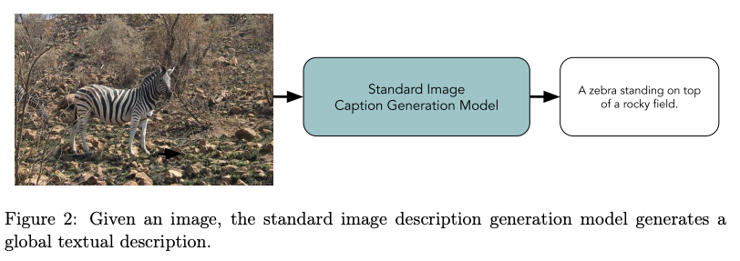   2. Visual Storytelling 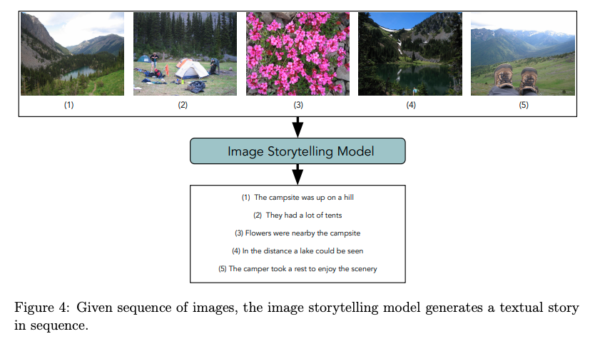   3. Image Question Answering 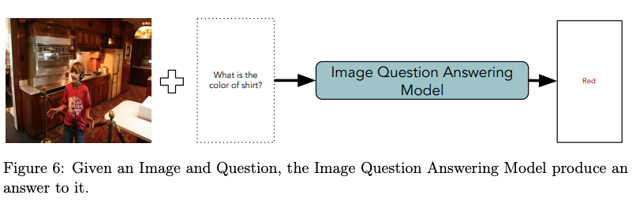   4. Visual Dialog 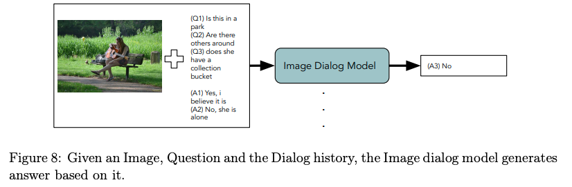   5. Visual Reasoning 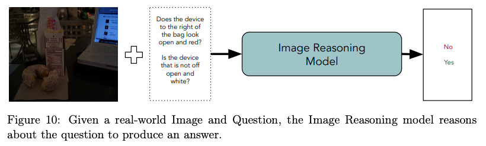   6. Image Referring 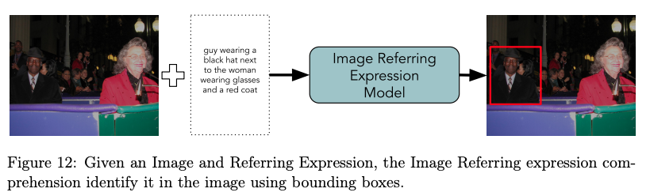   7. Text to Image 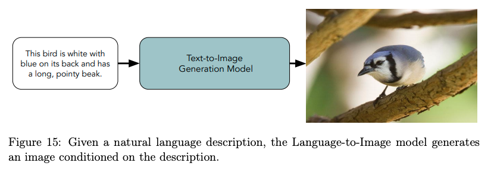   8. Image Guided Machine Translation 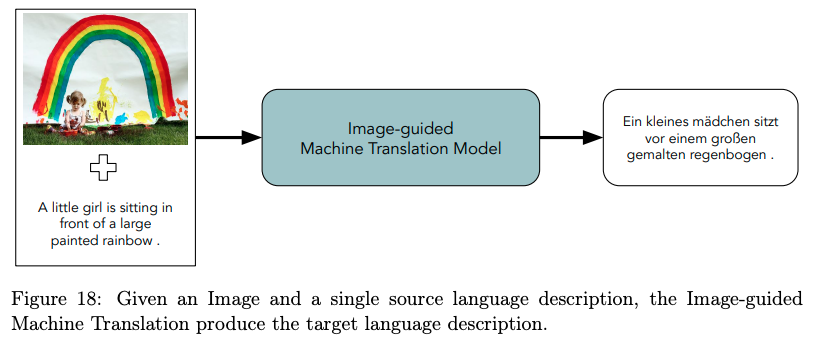
| Multimodal | [Deep Multimodal Representation Learning: A Survey](https://ieeexplore.ieee.org/abstract/document/8715409) | arXiv 2019 |  

Click to expand

|Multimodal | [Multimodal Machine Learning: A Survey and Taxonomy](https://arxiv.org/abs/1705.09406) | TPAMI 2018 |  

Click to expand

| Adversarial Attacks | [Adversarial Attacks on Deep-learning Models in Natural Language Processing: A Survey](https://arxiv.org/pdf/1901.06796.pdf) | ACM TIST 2019 |  

Click to expand
 (1) Existing perturbation methods for images cannot be directly applied to texts. (Discrete vs Continuous Inputs. / Perceivable vs Unperceivable perturbations / Semantic vs Semantic-less)   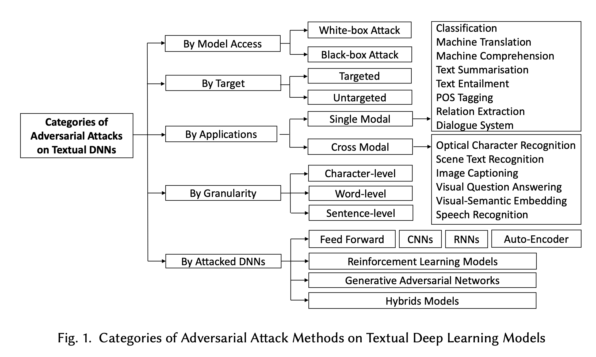

#### Github Compilations
* **Visual Grounding** Reading List by Arka Sadhu (@TheShadow29): https://github.com/TheShadow29/awesome-grounding 
* ✨**Multi-modal** [(Click)](awesome-multimodal.md) Reading List by Paul Liang (@pliang279): https://github.com/pliang279/awesome-multimodal-ml/
    

Click to expand: Core Areas

    * Representation Learning
    * Multimodal Fusion
    * Multimodal Alignment
    * Multimodal Translation
    * Missing or Imperfect Modalities
    * Knowledge Graphs and Knowledge Bases 
    * Interpretable Learning
    * Generative Learning 
    * Semi-supervised Learning 
    * Self-supervised Learning 
    * Language Models
    * Adversarial Attacks 
    * Few-shot Learning 
  
    | Core Areas |  Paper | Remark
    | ---------------- | ---- |  --- |
    | Representation Learning | 

Click to expand
 1. [12-in-1: Multi-Task Vision and Language Representation Learning](https://arxiv.org/abs/1912.02315), CVPR 2020 [[code]](https://github.com/facebookresearch/vilbert-multi-task)   2. [VL-BERT: Pre-training of Generic Visual-Linguistic Representations](https://arxiv.org/abs/1908.08530), arXiv 2019 [[code]](https://github.com/jackroos/VL-BERT)   3. [ViLBERT: Pretraining Task-Agnostic Visiolinguistic Representations for Vision-and-Language Tasks](https://arxiv.org/abs/1908.02265), NeurIPS 2019 [[code]](https://github.com/jiasenlu/vilbert_beta)   4. [LXMERT: Learning Cross-Modality Encoder Representations from Transformers](https://arxiv.org/abs/1908.07490), EMNLP 2019 [[code]](https://github.com/airsplay/lxmert)    5. [VideoBERT: A Joint Model for Video and Language Representation Learning](https://arxiv.org/abs/1904.01766), ICCV 2019 | 

Click to expand
12-in-1    VLBERT    ViLBERT   LXMERT   VideoBERT
    

    

Click to expand: Applications and Datasets

    * Language and Vision QA
    * Language Grounding in Vision
    * Language Grounding in Navigation 
    * Multimodal Machine Translation 
    * Multi-agent Communication 
    * Commensense Reasoning 
    * Multimodal Reinforcement Learning
    * Multimodal Dialogue
    * Language and Audio
    * Audio and Vision
    * Media Description
    * Video Generation from Text
    * Affect Recognition and Multimodal Language 
    * Healthcare
    * Robotics

#### Other Resources

* **Sebastian Ruder** (DeepMind): https://ruder.io/
  * **NLP-progress**: https://nlpprogress.com/ (Repository to track the progress in Natural Language Processing (NLP), including the datasets and the current state-of-the-art for the most common NLP tasks.)
    

Click to expand

    * Automatic speech recognition
    * Common sense
    * Constituency parsing
    * Coreference resolution
    * Dependency parsing
    * Dialogue
    * Domain adaptation
    * Entity linking
    * Grammatical error correction
    * Information extraction
    * Intent Detection and Slot Filling
    * Language modeling
    * Lexical normalization
    * Machine translation
    * Missing elements
    * Multi-task learning
    * Multi-modal
    * Named entity recognition
    * Natural language inference
    * Part-of-speech tagging
    * Question answering
    * Relation prediction
    * Relationship extraction
    * Semantic textual similarity
    * Semantic parsing
    * Semantic role labeling
    * Sentiment analysis
    * Shallow syntax
    * Simplification
    * Stance detection
    * Summarization
    * Taxonomy learning
    * Text classification
    * Time-stamping
    * Word sense disambiguation
* **huggingface**: https://huggingface.co/transformers/ 
  * Transformers 🤗provides general-purpose architectures (*BERT, GPT-2, RoBERTa, XLM, DistilBert, XLNet…*) for Natural Language Understanding (NLU) and Natural Language Generation (NLG) with over 32+ pretrained models in 100+ languages and deep interoperability between TensorFlow and PyTorch.
* **nlp-newsletter** (@dair-ai): https://github.com/dair-ai/nlp_newsletter 
* **nlp-hightlights-podcasts** (@Allen AI): https://soundcloud.com/nlp-highlights 
  
#### Workshops and Tutorials

Click to expand

S
|  Title | Venue| 
| ---------------- | ---- | 
| [Grand Challenge and Workshop on Human Multimodal Language](http://multicomp.cs.cmu.edu/acl2020multimodalworkshop/) | ACL 2020, ACL 2018
| [Advances in Language and Vision Research](https://alvr-workshop.github.io/) | ACL 2020
| [Visually Grounded Interaction and Language](https://vigilworkshop.github.io/) | NeurIPS 2019, NeurIPS 2018
| [The How2 Challenge: New Tasks for Vision & Language](https://srvk.github.io/how2-challenge/) | ICML 2019
| [Visual Question Answering and Dialog](https://visualqa.org/workshop.html) | CVPR 2019, CVPR 2017

#### Other Readings
| Type |  Title  | Author 
| ---------------- | ---- |  --- |
| Book | [A Stochastic Grammar of Images](http://www.stat.ucla.edu/~sczhu/papers/Reprint_Grammar.pdf) | Song-Chun Zhu, 2007
| Talks | [Representations for Language: From Word Embeddings to Sentence Meanings](https://nlp.stanford.edu/manning/talks/Simons-Institute-Manning-2017.pdf) | Christopher Manning, 2017
| Medium | [The Best and Most Current of Modern Natural Language Processing](https://medium.com/huggingface/the-best-and-most-current-of-modern-natural-language-processing-5055f409a1d1) | Victor Sanh, 2019

