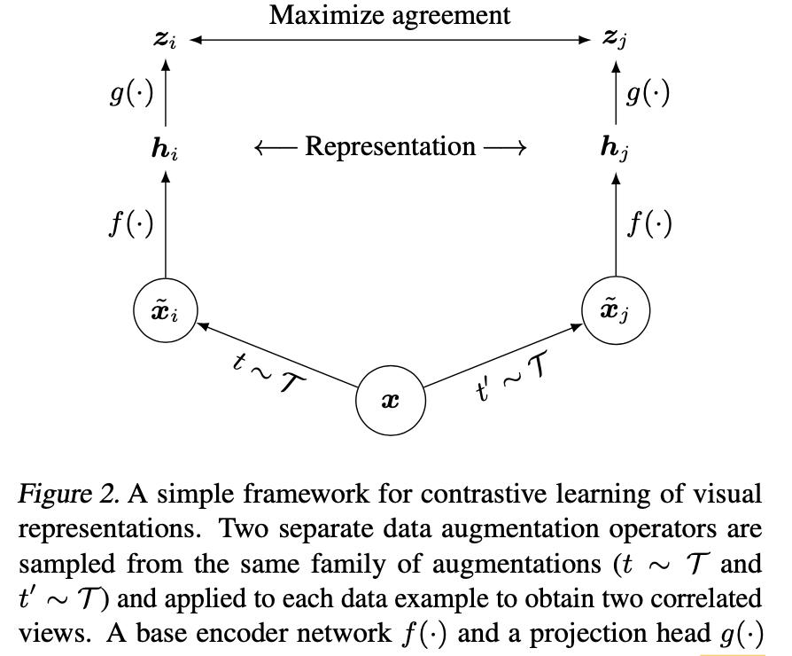

|  Paper | Venue | Remark
| ---------------- | ---- | ------------ | 
| [Image Transformer](https://arxiv.org/pdf/1802.05751.pdf)| arxiv 2018  (rejected by ICLR2018)|
|[Contrastive Multiview Coding](https://arxiv.org/pdf/1906.05849.pdf) | arxiv 2020 (v2)|
| [Unsupervised Learning of Visual Representations by Solving Jigsaw Puzzles](https://arxiv.org/pdf/1603.09246.pdf) | 
|[Conditional Image Generation with PixelCNN Decoders](https://arxiv.org/pdf/1606.05328.pdf)| NIPS 2016 |
| [Pixel Recurrent Neural Networks](https://arxiv.org/pdf/1601.06759.pdf)| 
|[Unsupervised Learning of Visual Representations by Solving Jigsaw Puzzles](https://arxiv.org/pdf/1603.09246.pdf) | ECCV 2016 | 
| [Improving Generalization via Scalable Neighborhood Component Analysis](http://openaccess.thecvf.com/content_ECCV_2018/papers/Zhirong_Wu_Improving_Embedding_Generalization_ECCV_2018_paper.pdf) | ECCV 2018 | 
| [PatchVAE: Learning Local Latent Codes for Recognition](https://arxiv.org/pdf/2004.03623.pdf) | arxiv 2020 | 
| [Steering Self-Supervised Feature Learning Beyond Local Pixel Statistics](https://arxiv.org/pdf/2004.02331.pdf) | arxiv 2020 |
| [Representation Learning with Contrastive Predictive Coding](https://arxiv.org/abs/1807.03748)|arxiv 2019   (rejected by ICLR2020) | [`Talk`](https://slideslive.com/38922758/invited-talk-contrastive-predictive-coding) | 
| [The Right Tool for the Job: Matching Model and Instance Complexities](https://arxiv.org/pdf/2004.07453.pdf) | ACL 2020 [[code] (pytorch)](https://github.com/allenai/sledgehammer)| 
| [A Simple Framework for Contrastive Learning of Visual Representations](https://arxiv.org/pdf/2002.05709.pdf) | arxiv 2020 [[code] (TPU+TF)](https://github.com/google-research/simclr) | We show that (1) **composition of data augmentations** plays a critical role in defining effective predictive tasks, (2) introducing **a learnable nonlinear transformation** between the representation and the contrastive loss substantially improves the quality of the learned representations, and (3) contrastive learning benefits from **larger batch sizes and more training steps** compared to supervised learning.   