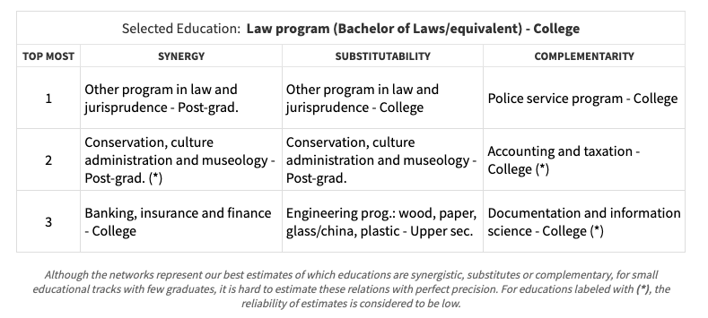
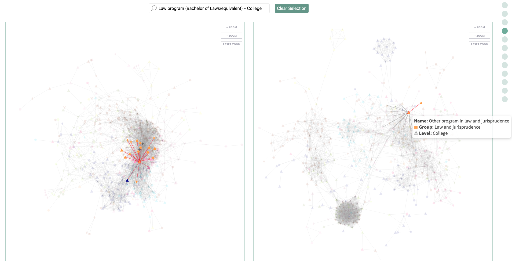
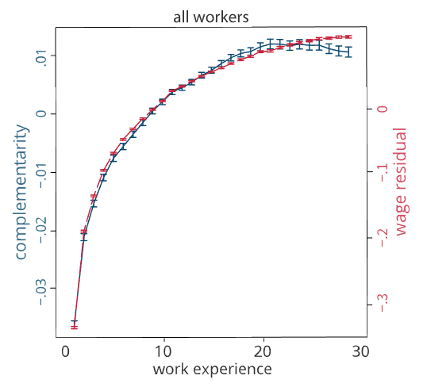
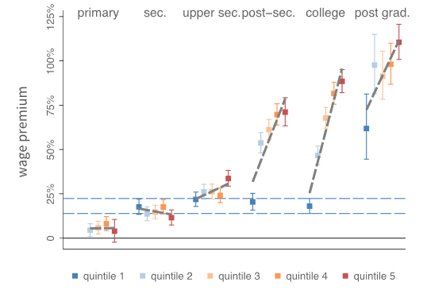
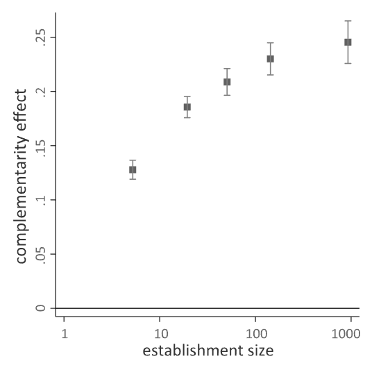
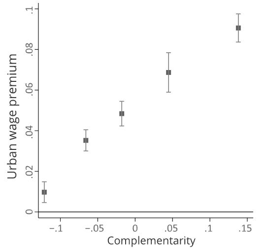

### [HOW THE VALUE OF YOUR SKILLS DEPENDS ON WITH WHOM YOU WORK](https://growthlab.cid.harvard.edu/academic-research/complementarity)
Paper by Frank Neffke. Design and Visualizations by Kyle Soeltz and Nil Tuzcu. @Harvard, Growth Lab

#### Abstract
The research shows that in today’s complex economy, where many people are heavily specialized, **having complementary coworkers is crucial**. However, the benefits of working with complementary coworkers are not the same for all workers. **Higher educated workers seem to benefit much more** from working in complementary teams than lower educated workers. Moreover, on average, over the past 20 years, workers with college degrees or higher have been more and more able to **find better matching coworkers**.
#### Visualize Networks
|  Synergy | Substitutability | Complementarity | Plot
| ---------------- | ---- | ------------ | --
| **Synergistic eductions**: defined as eductions that are often found in the same establishments (complement or substitute). | **Substitutes educations**: if they allow workers tio carry out the same tasks. (two educations that allow their graduates to move into similar occupations.) | **Complementary coworkers**: workers who are synergistic, without having much overlap between their skills. |  | 
| **The first network** (shown below) connects educational **tracks** if they are often found in the same economic establishments (**direct colleagues**). | **The second network** is built in a similar way as the educational synergies network. Nodes still represent educational tracks. However, **links** now represent **the degree to which we estimate** two educations to be **able to substitute for one another**. | |

#### The Importance of Complementary
|  Wages | Return to Education | Explains why large establishments pay more | Explains why cities pay more
| ---------------- | ---- | ---- | ----
| 1. In general, working with a highly complementary team of coworkers tends to be associated with significantly higher wages.   2. The wage effects of complementarity are strong: For college-educated workers, having highly complementary coworkers is as valuable as the college degree itself.   3. The increase in complementarity as workers gain work experience and find better fitting jobs slows down at a strikingly similar rate as the increase in their wages. | Those who work with many complementary coworkers earn a (for Swedish standards) hefty premium: 88% higher wages than workers with only primary school degrees.   In contrast, college educated workers who have few coworkers who complement them earn just 18% higher wages than workers with primary school degrees. | For most workers, what really matters is not the overall size of the establishment in which they work, but rather how many workers in that establishments can complement them. | The urban wage premium is contingent on finding coworkers with complementary skills. For workers who do, working in a large city like Boston really pays off. 
|  |  |  | 

#### A Closer Look: Measureing Synergy, Substitutability & Complementarity
* Measure of Synergy: (normalized) count each pair of $e,e^{\prime}, e^{\prime \prime}$
* Measure of Substitutability: compute the similarity of two occupational distribution $s_{ee^{\prime}}=Corr(D(e), D(e^{\prime}))$,
where $D(e) = (d_1,d_2,d_3,d_4,d_5,d_6,d_7)$ (i.e., a 7-dimensional histogram)
* Measure of Complementarity: excess synergies that cannot be explained by substitutability.