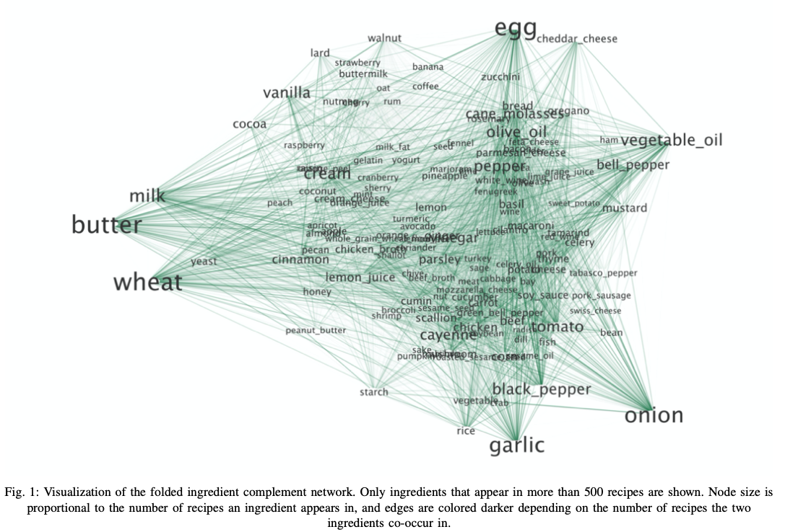
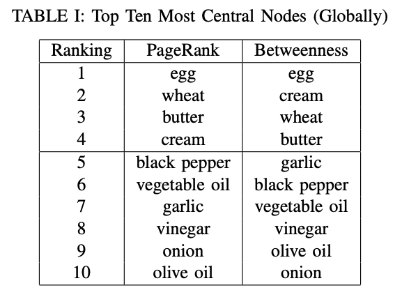
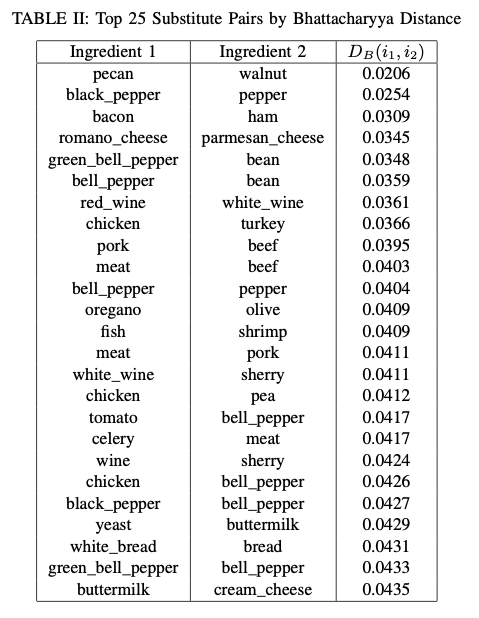
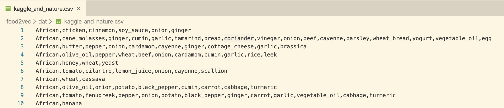
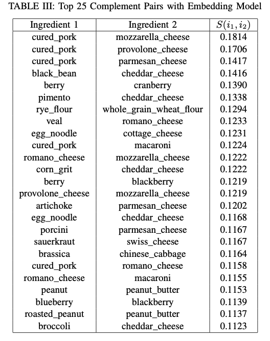
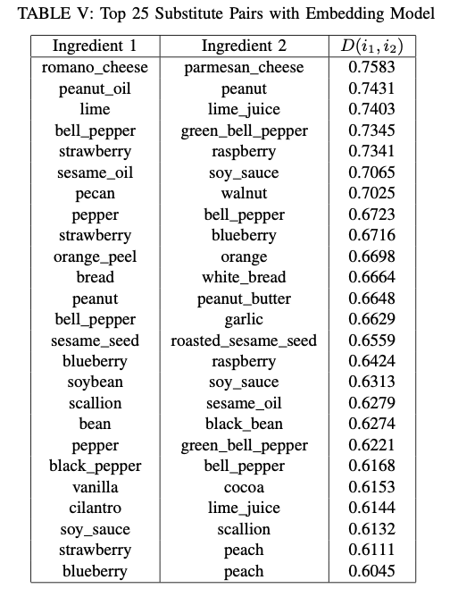
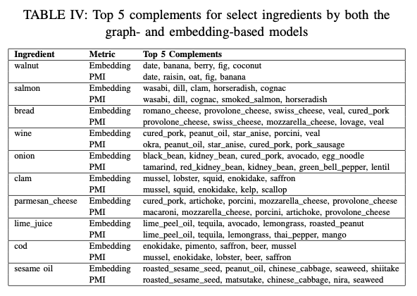
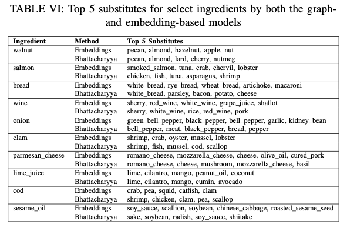

#### [Cooking up Food Embeddings Understanding Flavors in the Recipe-Ingredient Graph](http://snap.stanford.edu/class/cs224w-2017/projects/cs224w-34-final.pdf)

| Paper | Year | Author | Metric
| --- | --- | --- | --- 
| [Flavor network and the principles of food pairing](https://www.nature.com/articles/srep00196) | 2011 | Yong-Yeol Ahn @Northeastern | Edge weights: $w(i,j)=$ # of compounds $i$ and $j$ share.   Relative prevalence: $$p_{i}^{c}=P_{i}^{c}-\left\langle P_{i}^{c^{\prime}}\right\rangle_{c^{\prime} \neq c}$$
| [Recipe Recommendation Using Ingredient Networks](https://arxiv.org/pdf/1111.3919.pdf) | 2012 | Chun-Yuen Teng @Michigan | Edge weights: Pointwise Mutual Information (PMI) between $a$ and $b$, $$P M I(a, b)=\log \frac{p(a, b)}{p(a) \cdot p(b)}$$ In parallel, the Teng et al. create a substitute network define edge using conditonal distribution.
| [food2vev](https://github.com/altosaar/food2vec)| 2017 | Jaan Altosaar @Princeton| First, problems with the dataset muddy the results. As mentioned, the dataset includes AllRecipes data twice.   Second, and more importantly, the choice to simply run fastText with default parameters—rather than modify the algorithm to fit the recipe task—causes problems in the results. Because skipgrams only capture nearby pairings, food2vec unknow- ingly only attempts to record food pairings. This leads food2vec’s simi- larity metric to more accurately reflect ingredients that are complements than it does similar ingredients that could be substituted. 

* [Ahn's Dataset](https://raw.githubusercontent.com/altosaar/food2vec/master/dat/kaggle_and_nature.csv)
* [FastText PyTorch Implementation](https://github.com/AnubhavGupta3377/Text-Classification-Models-Pytorch/tree/master/Model_fastText)
  
#### Motivation
Teng et al., and Ahn et al., focus their efforts almost entirely on **local metrics** and **counts** rather than analyzing the **global structure** of the graph. Just as PageRank and HITS use global vector-based analysis to provide significant additional insight over local and count based analysis, there seemed to be significant opportunity to **use global vector-based methods** to **better understand the structure** of the bipartite ingredients ↔ recipes graph.

Altosaar makes a valuable contribution by seeing that word embeddings can be applied to find embeddings for recipe ingredients, and his interactive visualizations are excellent; however, problems and oversights in his methodology leave clear room for future exploration. By using a modified bag-of-words model, choosing a more appropriate embedding size, and using clean data, we hope to be able to embed ingredients based on flavor and complementarity more effectively than food2vec.

#### Approach Summary
we use Ahn’s dataset and the complement network methodology introduced in Teng. to do the following:
1) We use the structure of the graph, and, in particular, our varying edge weight definitions to elucidate more information about ingre- dient complementarity.
2) We gain a more robust understanding of the foundational roles of ingredients, both globally and by cuisine by applying more rigorous network analysis tools (namely, an assortment of centrality metrics).
3) We propose a graph-based metric to measure ingredients that are good substitutes for each other as well as build on Altosaar’s work and FastText to create an embedding-based approach for **graph visualization**, **complement and substitute prediction**, and **recipe generation**. Notably, these metrics do not rely on scraped information of suggested substitutes, as Teng et al. do.

#### Dataset
Our dataset (the same one used in Ahn et. al.) consists of 56,498 recipes from 11 different cuisine types scraped off of epicurious.com, allrecipes.com, and menupan.com.

#### Graph Structure
We construct the **bipartite graph of ingredients to recipes**, then fold that graph to create **a weighted, undirected ingredient-to-ingredient graph.** We use three different weight metrics $w$ for any pair of ingredients $i, j$:
* **Raw Count**, scaled
* **Pointwise Mutual Information (PMI)**: $P M I(i, j)=\log \frac{p(i, j)}{p(i) \cdot p(j)}=\log \frac{p(i | j)}{p(i)}=\log \frac{p(j | i)}{p(j)}$, with domain: $(-\infty, \infty)$, unscaled
* **Intersection Over Union (IOU)**: $I O U(i, j)=\frac{\left|R_{i} \cap R_{j}\right|}{\left|R_{i} \cup R_{j}\right|}$, with domain: [0,1], unscaled

We ran four main centrality metrics on the folded ingredient graphs to understand the underlying structure of the recipe graph: **betweenness**, **closeness**, **PageRank**, and **degree centrality**.

 

    
    

#### Ingredient Complements and Substitutes Using Network Algorithms

##### Complements
We defined the complementarity between two ingredients $i, j$ using the three different edge weight metrics discussed above: $Count(i,j)$,$IoU(i,j)$, and $PMI(i,j)$. We were particularly excited about the predictive effect of PMI because it can be interpreted as a monotonic transformation of the conditional probability of one ingredient occurring given the other relative to its baseline probability.

##### Substitutes
We proposed the following metric (not efficient)

$$
\operatorname{sub}_{a, b}=\frac{\sum_{i} \max _{j} I o U\left(X_{i}, Y_{j}\right)+\sum_{j} \max _{i} I o U\left(X_{i}, Y_{j}\right)}{|A \cap B|+1} 
$$

For our second metric. Intuitively, two ingredients appear in similar contexts if the distributions of ingredients that co-occur with them are similar. One good metric of similarity between two observed distributions is the Bhattacharyya distance,

$$
D_{B}(p, q) =-\log \sum_{x \in X} \sqrt{p(x) q(x)} = -\log \sum_{x \in I} \sqrt{\frac{R_{p, x}}{\sum_{y \in I} R_{p, y}} \frac{R_{q, x}}{\sum_{z \in I} R_{q, z}}}
$$

Rather than taking several years of CPU power to compute, this metric took 10 seconds to compute for all pairs of ingredients.

    

#### Modeling the Graph with Food Embeddings
##### `Training`
* We modified the source code of **fastText** to adapt it to this task: **sampling complete recipes**, **removing an ingredient**, and **asking the model to predict the missing ingredient**.
* Built our own cross- validation tools: we randomly shuffled the recipe set and held out **10% of recipes as a validation set**. 
* We then implemented a **cross-entropy loss** on GPU with PyTorch to be able to evaluate models on the validation set.
* We therefore **chose the embedding size to be 175**, approximately where the the loss hits its asymptote.
* To reach convergence, we trained the models for **5,000 epochs** (overnight). 
* Though there are tradeoffs to using the subword information-based model, we still decided to use it for the remainder of our tasks.

    

##### Complements 
Cbow causes the model to train an input vector of one ingredient to have a high dot product with the output vector of another ingredient if the presence of the first ingredient predicts/increases the likelihood of the presence of the second. Thus, cbow trains output vectors to be complements of input vectors.
To find the best complement for a given ingredient $i$ with input vector $x_i$, we find the maximum cosine similarity as

$$
\operatorname{argmax}_{j} \frac{x_{i} \cdot o_{j}}{\left\|x_{i}\right\|_{2}\left\|o_{j}\right\|_{2}}
$$

where $o_j$ is the output vector of ingredient $j$. Even though the cbow algorithm explicitly maximizes dot product, we choose to use cosine distance since it does not take into account the scale of input and output vectors, and thus does not discriminate against less frequently seen ingredients.

##### Substitutes
In our embedding approach, ingredients that appear in similar contexts will have similar values because they will recieve similar gradient updates. For an ingredient $i$ with input vector $x_i$, we say its best substitute (represented by index $j$ and input vector $x_j$)

$$
\operatorname{argmax}_{j} \frac{x_{i} \cdot x_{j}}{\left\|x_{i}\right\|_{2}\left\|x_{j}\right\|_{2}}
$$

Again, we use cosine similarity instead of dot product to make sure that we do not discriminate against less frequent ingredients, and have a frequency cutoff to make sure extremely rare ingredients do not appear as substitutes.

    

##### Comparison

    

