### [Space-Time Correspondence as a Contrastive Random Walk](https://arxiv.org/pdf/2006.14613.pdf)
Allan Jabri, Andrew Owens, Alexei A. Efros
(UC Berkeley, University of Michigan)

**Aim:**
> Learn a similarity representation for correspondence from unlabeled video.

**Focus**
> Simplicity & Scalability

#### Palindrome Sequence

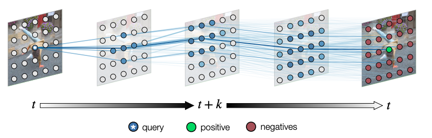

#### Video as a Graph

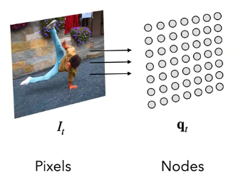
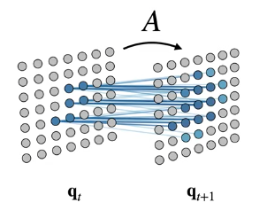

##### One Step (Contrastive Learning)

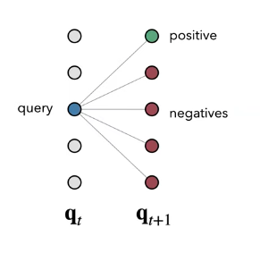
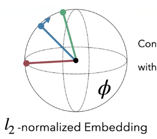

Maximize
$P\left(X_{t+1}=\operatorname{pos} \mid X_{t}=q u e r y\right)=\frac{e^{\phi(q u e r y)^{\top} \phi(p o s)}}{\sum_{q_{l}} e^{\phi(q u e r y)^{\top} \phi\left(q_{l}\right)}}$
$k$-step Transition Matrix
$\bar{A}_{t}^{t+k}=\prod_{i=0}^{k-1} A_{t+i}^{t+i+1}=P\left(X_{t+k} \mid X_{t}\right)$

##### Chaining Correspondences

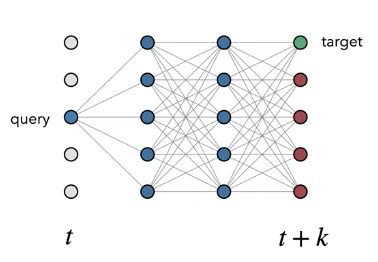

##### Supervised -> Self-Supervised 

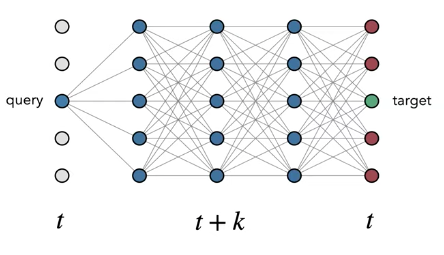

Train on Palindromes: $\mathcal{L}_{c y c}^{k}=\mathcal{L}_{C E}\left(\bar{A}_{t}^{t+k} \bar{A}_{t+k}^{t}, I\right)$

#### Implementation

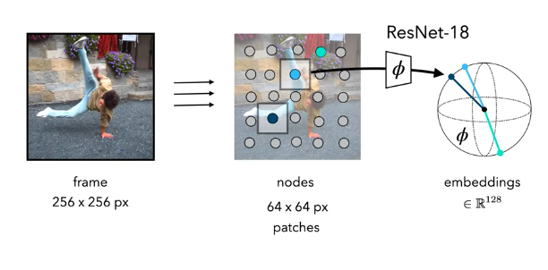
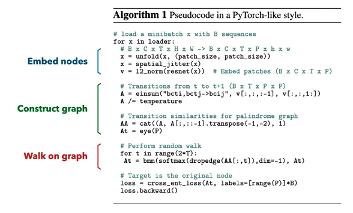

#### Training Details
* Trained on the unlabeled Kinetics-400 dataset (Kay et al. 2017)
* Adam optimizer, $lr = 0.0001$
* One million weight updates
* 3x GPUs for 24-sequence batches
  * Can train with 1 GPU, 8-sequence batches

#### Evalutaion (use $\phi$ for Label Propagation)

**Label Propagation**
Weighted average of labels from K nearest neighbors

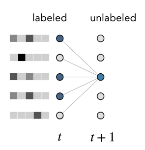

##### "Common Fate" by Edge Dropout

#### Paper Context
##### Contrastive Random Walks on Video
**Notations**
* $\mathbf{I}$: a set of frames of a video
* $\mathbf{q}_{t}$: the set of $N$ nodes extracted from frame $\mathbf{I}_t$
* $\phi$: an encoder maps nodes to $l_2$-normalized $d$-dimensional vectors, which we use to compute a pairwise similarity function $d_{\phi}\left(q_{1}, q_{2}\right)=\left\langle\phi\left(q_{1}\right), \phi\left(q_{2}\right)\right\rangle$, and
* $Q_{t} \in \mathbb{R}^{N \times d}$: an embedding matrix for $\mathbf{q}_{t}$
* $A_{t}^{t+1}(i, j)$: the stochastic matrix of affinities for two adjacent timesteps $t$ and $t+1$; apply softmax to convert to non-negative affinities
$$
A_{t}^{t+1}(i, j)=\operatorname{softmax}\left(Q_{t} Q_{t+1}^{\top}\right)_{i j}=\frac{\exp \left(d_{\phi}\left(\mathbf{q}_{t}^{i}, \mathbf{q}_{t+1}^{j}\right) / \tau\right)}{\sum_{l} \exp \left(d_{\phi}\left(\mathbf{q}_{t}^{i}, \mathbf{q}_{t+1}^{l}\right) / \tau\right)}
$$
* Let $X_t$ be the state of the walker at time $t$, with transition probability 
$$A_{t}^{t+1}(i, j)=P\left(X_{t+1}= j \mid X_{t}=i\right)$$, where $P(X_t=i)$ is the probability of being at node $i$ at time $t$. With this view, we can formulate long-range correspondence as walking multiple steps along the graph.
$$
\bar{A}_{t}^{t+k}=\prod_{i=0}^{k-1} A_{t+i}^{t+i+1}=P\left(X_{t+k} \mid X_{t}\right)
$$

##### Guiding the walk
Suppose that we have ground-truth correspondence labels between nodes in two frames of a video,  the walk can be viewed as a chain of **contrastive learning** problems
$$
\mathcal{L}_{s u p}=\mathcal{L}_{C E}\left(\bar{A}_{t}^{t+k}, Y_{t}^{t+k}\right)=-\sum_{i=1}^{N} \log P\left(X_{t+k}=Y_{t}^{t+k}(i) \mid X_{t}=i\right)
$$

#### Self-supervision with palindromes
$$
\mathcal{L}_{c y c}^{k}=\mathcal{L}_{C E}\left(\bar{A}_{t}^{t+k} \bar{A}_{t+k}^{t}, I\right)=-\sum_{i=1}^{N} \log P\left(X_{t+2 k}=i \mid X_{t}=i\right)
$$

#### Label propagation

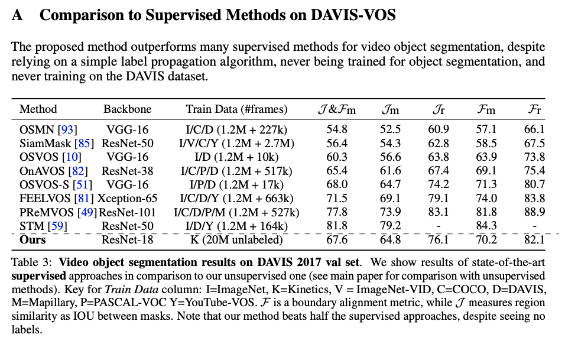

