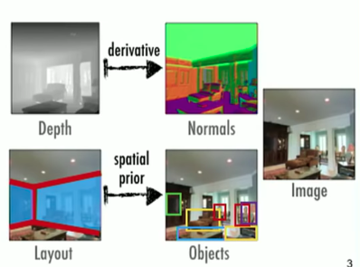
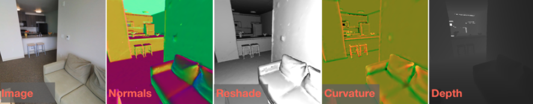
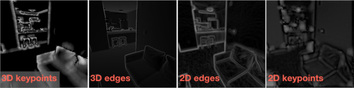
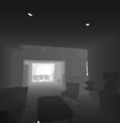
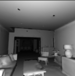
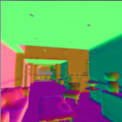

### [Robust Learning Through Cross-Task Consistency](#cvpr2020-robust-learning-through-cross-task-consistency)

### [TASKONOMY: Disentangling Task Transfer Learning](http://taskonomy.stanford.edu/)

Amir R. Zamir, Alexander Sax, William B. Shen, Leonidas Guibas, Jitendra Malik, Silvio Savarese

> * A fully computational method for quantifying task relationships
> * Extracting a structure out of them
> 
#### Task Relationships

Many Tasks -> Dense Relationships -> Redundancy -> Efficieny

**Task Bank**
* **26** Semantic, 2D, 3D tasks

**Dataset**
* **4 million** real Images
* Each image has the GT label for all tasks

**Task-Specific Networks**
* 26 networks

#### Experimental Results
* 26 Task-specific Networks
* 3000 Transfer Networks
* 47,829 GPU hours
* Transfers training data: 8x-120x less than task-specific

### Summary
* A striving step towards understanding the space of vision tasks.
* Treat tasks in concert, coming from a structured space, rather than isolated concepts.
* A fully computational framework.
* Transfer learning. Generalist perception model.

#### 24 Tasks
* DENOISING AUTOENCODER (Uncorrupted version of corrupted image)
* SURFACE NORMALS (Pixel-wise surface normal)
* Z-BUFFER DEPTH (Depth estimation)
* COLORIZATION (Colorizing input grayscale images)
* RESHADING (Reshading with new lighting placed at camera location)
* ROOM LAYOUT (Orientation and aspect ratio of cubic room layout)
* CAMERA POSE (FIXATED | Relative camera pose with matching optical centers)
* CAMERA POSE (NONFIX | Relative camera pose with distinct optical centers)
* VANISHING POINTS (Three Manhattan-world vanishing points)
* CURVATURES (Magnitude of 3D principal curvatures)
* UNSUPERVISED 2D SEGM (Segmentation, graph cut approximation on RGB)
* UNSUPERVISED 2.5D SEGM (Segmentation, graph cut approximation on RGB-D-Normals-Curvature image)
* 3D KEYPOINTS (3D Keypoint estimation from underlying scene 3D)
* 2D KEYPOINTS (Keypoint estimation from RGB-only, texture features)
* OCCLUSION EDGES (Edges which occlude parts of the scene)
* TEXTURE EDGES (Edges computed from RGB only, texture edges)
* INPAINTING (Filling in masked center of image)
* SEMANTIC SEGMENTATION (Pixel-wise semantic labeling via knowledge distillation from MS COCO)
* OBJECT CLASSIFICATION (1000-way object classification via knowledge distillation from ImageNet)
* SCENE CLASSIFICATION (Scene Classification (via knowledge distillation from MIT Places)
* JIGSAW PUZZLE (Putting scrambled image pieces back together)
* EGOMOTION (Odometry (camera poses) given three input images)
* AUTOENCODER (Image compression and decompression)
* POINT MATCHING (Classifying if centers of two images match or not)

### CVPR2020: [Robust Learning Through Cross-Task Consistency](https://github.com/EPFL-VILAB/XTConsistency)

#### Introduction
**`What is consistency?`** Suppose an object detector detects a ball in a particular region of an image, while a depth estimator returns a flat surface for the same region. This presents an issue -- at least one of them has to be wrong, because they are inconsistent.

**`Why is it important?`** Desired learning tasks are usually predictions of **different aspects of a single underlying reality** (the scene that underlies an image). Inconsistency among predictions implies contradiction.

Consistency constraints are informative and can be used to better fit the data or lower the sample complexity. **They may also reduce the tendency of neural networks to learn "surface statistics" (superficial cues) by enforcing constraints rooted in different physical or geometric rules.** This is empirically supported by the improved generalization of models when trained with consistency constraints.

**`How do we enforce it?`** The underlying concept is that of path independence in a network of tasks. **Given an endpoint Y2, the path from X->Y1->Y2 should give the same results as X->Y2**. This can be generalized to a larger system, with paths of arbitrary lengths. In this case, the nodes of the graph are our prediction domains (eg. depth, normal) and the edges are neural networks mapping these domains.

#### Consistency Domains
This repository considers transferring between image domains, and our networks were trained for transferring between the following domains from the [Taskonomy dataset](https://github.com/StanfordVL/taskonomy/tree/master/data).

**🐰Used Tasknomy Tasks**

    Curvature         Edge-3D            Reshading
    Depth-ZBuffer     Keypoint-2D        RGB       
    Edge-2D           Keypoint-3D        Surface-Normal 

**🐈Unused Tasknomy Tasks**

    Denoising Autoencoder         Colorization                Room Layout
    Camera Pose (FIX.)            Camera Pose (NOFIX.)        Vanishing Points       
    2D Segments                   2.5D Segments               Occlusion Edges 
    Texture Edges                 Inpainting                  Semantic Segmentation 
    Object Classification         Scene Classification        Jigsaw Puzzle 
    Egomotion                     Autoencoder                 Point Matching 
#### Network Architecture
The repo contains consistency-trained models for `RGB -> Surface-Normals`,  `RGB -> Depth-ZBuffer`, and `RGB -> Reshading`. In each case the remaining 7 domains are used as consistency constraints in during training. 
All networks are based on the [UNet](https://arxiv.org/pdf/1505.04597.pdf) architecture. They take in an input size of 256x256, upsampling is done via bilinear interpolations instead of deconvolutions and trained with the L1 loss.

|        Task Name        | Output Dimension | Downsample Blocks |
|-------------------------|------------------|-------------------|
| `RGB -> Depth-ZBuffer`  | 256x256x1        | 6                 |
| `RGB -> Reshading`      | 256x256x1        | 5                 |
| `RGB -> Surface-Normal` | 256x256x3        | 6                 |

### Energy Computation
Training with consistency involves several paths that each predict the target domain, but using different cues to do so. The disagreement between these predictions yields an unsupervised quantity, consistency energy, that our CVPR 2020 paper found correlates with prediciton error.

|             Sample Image             |             Normal Prediction             |             Consistency Energy             |
|:------------------------------------:|:------------------------------------:|:------------------------------------:|
|   |   |   |
| _Sample image from the Stanford 2D3DS dataset._  | _Some chair legs are missing in the `RGB -> Normal` prediction._  |  _The white pixels indicate higher uncertainty about areas with missing chair legs._  | 
